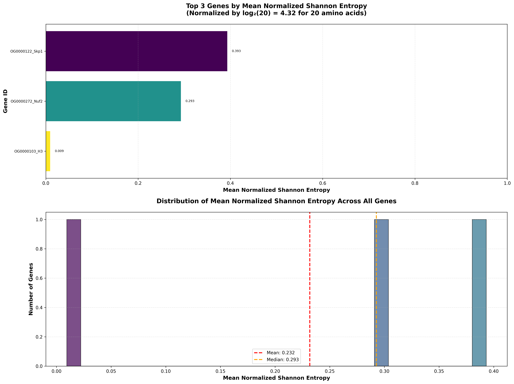
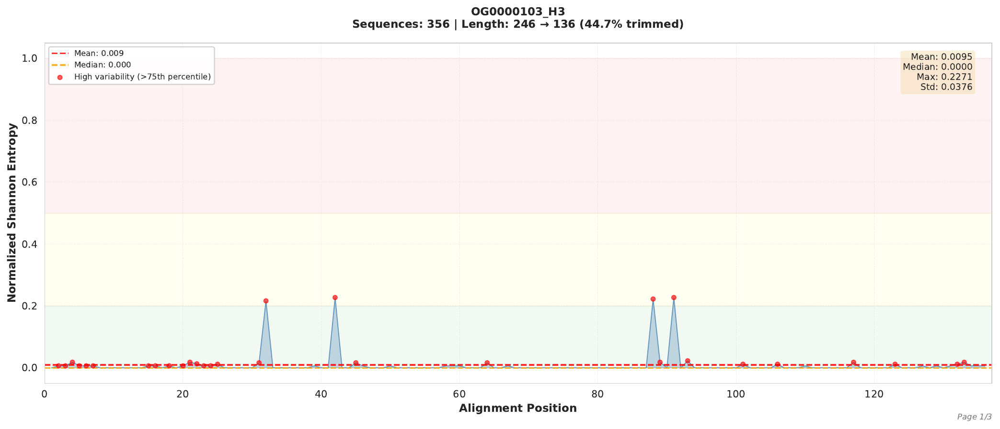
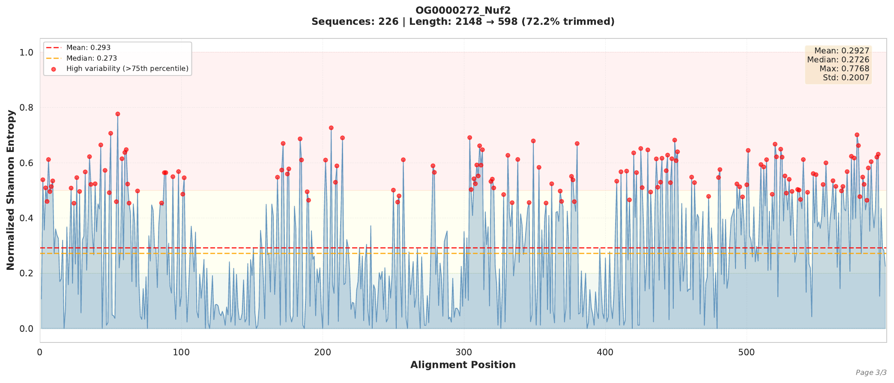
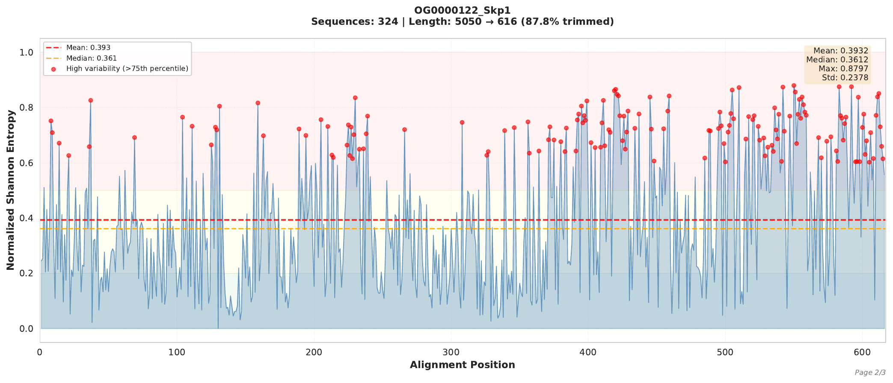

# Entropia-MSA: Shannon Entropy Analysis for Multiple Sequence Alignments

[](https://www.python.org/)
[](LICENSE)

A comprehensive toolkit for calculating and visualizing Shannon entropy in protein multiple sequence alignments (MSAs). Designed for comparative genomics and phylogenomics studies.

> **See [Example Outputs](#example-outputs)** below for visualization examples from the included sample data.

## Features

- **Shannon Entropy Calculation**: Calculate normalized Shannon entropy for amino acid alignments
- **Gap Trimming**: Automatically remove poorly aligned regions (>80% gaps)
- **Positional Entropy Profiles**: Generate detailed entropy plots along alignment positions
- **Copy Number Integration**: Combine entropy metrics with gene copy number heatmaps
- **Publication-Ready Figures**: Export high-quality PDF, PNG, and SVG visualizations

## Installation

### Requirements

```bash
# Create conda environment
conda create -n entropia python=3.8
conda activate entropia

# Install dependencies
pip install numpy pandas matplotlib seaborn
```

### Dependencies

- Python ≥ 3.8
- NumPy
- Pandas
- Matplotlib
- Seaborn

## Quick Start

### 1. Calculate Shannon Entropy

```bash
cd your_alignment_directory
python /path/to/entropia-msa/src/calculate_shannon_entropy.py
```

**Input**: Multiple `.msa` files in FASTA format

**Output**:
- `shannon_entropy_results.csv`: Detailed statistics for all genes
- `entropy_plot.png`: Bar plot of genes ranked by entropy

### 2. Generate Positional Entropy Profiles

```bash
python /path/to/entropia-msa/src/plot_positional_entropy.py
```

**Output**:
- `positional_entropy_all_genes.pdf`: Multi-page PDF with one plot per gene

### 3. Create Integrated Heatmap (Optional)

For combining entropy with gene copy number data:

```bash
cd your_analysis_directory
python /path/to/entropia-msa/src/plot_heatmap_with_entropy.py
```

**Requirements**:
- `shannon_entropy_results.csv` from step 1
- `hits_arabidopsis.kinetochore_label_summary_with_complex.tsv` (copy number data)
- Phylogenetic tree in Newick format

**Output**:
- `kinetochore_heatmap_with_entropy.{png,pdf,svg}`

## Example Outputs

### Entropy Summary Plot

Overview of entropy distribution across genes:



*Bar plot showing genes ranked by mean normalized Shannon entropy, with distribution histogram.*

### Positional Entropy Profiles

Detailed entropy along alignment positions for individual genes:

#### Highly Conserved: Histone H3


*Mean entropy: 0.0095 - Extremely conserved protein with minimal variation.*

#### Moderately Variable: Nuf2


*Mean entropy: 0.2927 - Moderate sequence variation with conserved and variable regions.*

#### Highly Variable: Skp1


*Mean entropy: 0.3932 - High sequence variability across most positions.*

### Integrated Heatmap with Entropy

Combination of Shannon entropy and gene copy number data:


*Top: Entropy barplot (left) and copy number variance (right). Bottom: Gene copy number heatmap across species. X-axis labels show protein names color-coded by complex.*

## Methodology

### Shannon Entropy Formula

For each alignment position *i*:

```
H(i) = -Σ(p_a × log₂(p_a))
```

Where:
- `p_a` = frequency of amino acid `a` at position `i`
- Gaps are excluded from calculations

### Normalization

Entropy values are normalized by the maximum possible entropy:

```
H_normalized = H(i) / log₂(20)
```

Where `log₂(20) = 4.32` for 20 standard amino acids.

**Range**: 0 (completely conserved) to 1.0 (maximum variability)

### Gap Trimming

Alignment columns with ≥80% gaps are removed before entropy calculation to focus on reliably aligned regions.

### Copy Number Variance

The **Coefficient of Variation (CV)** measures copy number distribution across species:

```
CV = σ / μ
```

Where:
- `σ` = standard deviation of copy numbers
- `μ` = mean copy number

**Interpretation**:
- **High CV**: Uneven distribution (some species have many copies, others few)
- **Low CV**: Even distribution (similar copy numbers across species)

## Example Workflow

```bash
# 1. Navigate to alignment directory
cd /path/to/alignments/

# 2. Calculate entropy for all alignments
python ~/entropia-msa/src/calculate_shannon_entropy.py

# 3. Generate positional entropy profiles
python ~/entropia-msa/src/plot_positional_entropy.py

# 4. Review results
# - shannon_entropy_results.csv
# - entropy_plot.png
# - positional_entropy_all_genes.pdf
```

## Output Interpretation

### Shannon Entropy Zones

| Entropy Range | Conservation Level | Color Code |
|---------------|-------------------|------------|
| 0.0 - 0.2 | Highly conserved | Green |
| 0.2 - 0.5 | Moderately variable | Yellow |
| 0.5 - 1.0 | Highly variable | Red |

### Example Results

**Top Variable Proteins** (from Rhynchospora kinetochore analysis):
1. Skp1 / OG0000061 - Entropy: 0.2628
2. Skp1 / OG0001284 - Entropy: 0.2038
3. Skp1 / OG0001282 - Entropy: 0.1919

## File Formats

### Input: MSA Files

FASTA format with aligned sequences:

```
>Species1_gene
MARTKQTARKSTGGKAPR---KQLAT
>Species2_gene
MARTKQTARKSTGGKAPR---KQLAT
>Species3_gene
MARTK-TARKST--KAPR---KQLAT
```

### Output: CSV Results

| Column | Description |
|--------|-------------|
| gene_id | Gene/OG identifier |
| num_sequences | Number of sequences in alignment |
| original_length | Alignment length before trimming |
| trimmed_length | Alignment length after gap removal |
| mean_normalized_entropy | Average normalized Shannon entropy |
| median_normalized_entropy | Median entropy value |
| std_normalized_entropy | Standard deviation |
| max_normalized_entropy | Maximum entropy position |

## Advanced Usage

### Custom Gap Threshold

Edit `calculate_shannon_entropy.py`:

```python
# Line ~40
trimmed_seqs = trim_alignment(sequences, gap_threshold=0.8)  # Change to 0.7, 0.9, etc.
```

### Filter by Protein Complex

In `plot_heatmap_with_entropy.py`, modify filtering:

```python
# Line ~70
df = df[df["Complex"] == "CCAN"]  # Focus on specific complex
```

## Examples

Example data is provided in `data/example_alignments/`:
- `OG0000103_H3.msa` - Highly conserved histone H3
- `OG0000122_Skp1.msa` - Variable Skp1 protein
- `OG0000272_Nuf2.msa` - Moderately conserved kinetochore protein

Run on examples:

```bash
cd data/example_alignments
python ../../src/calculate_shannon_entropy.py
```

## Citation

If you use this tool in your research, please cite:

```
González, J. (2025). Entropia-MSA: Shannon Entropy Analysis for Multiple Sequence Alignments.
GitHub: https://github.com/jacgonisa/entropia-msa
```

### Method Citation

Shannon Entropy:
> Shannon, C. E. (1948). A mathematical theory of communication. Bell System Technical Journal, 27(3), 379-423.

## Troubleshooting

### Issue: "ModuleNotFoundError"

**Solution**: Ensure all dependencies are installed:
```bash
pip install numpy pandas matplotlib seaborn
```

### Issue: "No .msa files found"

**Solution**: Ensure you're in the directory containing alignment files, or modify the glob pattern in the script.

### Issue: "Memory Error"

**Solution**: Process alignments in batches for large datasets (>500 alignments).

## Contributing

Contributions are welcome! Please:
1. Fork the repository
2. Create a feature branch
3. Submit a pull request

## License

MIT License - see [LICENSE](LICENSE) file for details

## Contact

- **Author**: Javier González
- **GitHub**: [@jacgonisa](https://github.com/jacgonisa)
- **Repository**: https://github.com/jacgonisa/entropia-msa

## Acknowledgments

- Developed for the Rhynchospora phylogenomics project
- Shannon entropy implementation based on standard information theory principles
- Visualization inspired by ComplexHeatmap and seaborn libraries

## Version History

- **v1.0.0** (2025-11-20): Initial release
  - Shannon entropy calculation
  - Positional entropy profiles
  - Integrated heatmap visualization
  - Copy number variance metrics
